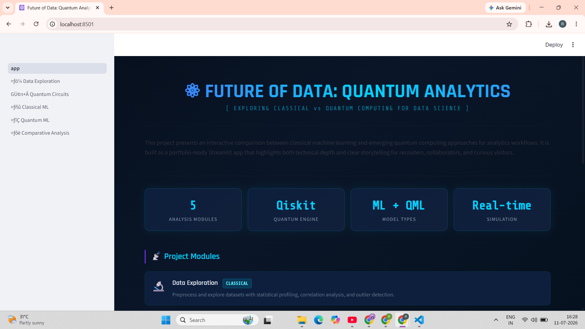

# Interactive Hybrid Quantum-Classical Data Analytics Platform

**Intern ID:** CITS2603


## Executive Summary

This project develops an interactive **Quantum Analytics Platform** integrating Streamlit, Pandas, scikit-learn, and Qiskit. The app enables classical data exploration, preprocessing, and model comparisons alongside quantum circuit simulations and variational classifiers. Users can visually compare classical machine learning models vs. quantum-enhanced methods, illustrating performance differences. The platform demonstrates how quantum computing can augment traditional data science workflows by providing a side-by-side evaluation of classical and quantum techniques.

## What this project demonstrates

- Classical data exploration and preprocessing workflows
- Classical machine learning model comparisons (Random Forest, SVM, Logistic Regression)
- Quantum circuit simulation and visualization using Qiskit
- Quantum machine learning concepts such as variational classifiers
- Side-by-side comparative analysis of classical vs quantum methods
- Full-stack interactive web application development
- Performance metrics and benchmarking

## Project structure

- app.py: main Streamlit entry point
- pages/: interactive analysis modules
- src/: reusable logic for data handling and modeling
- PROJECT_ROADMAP.md: planned improvements and milestones

## How to run

1. Clone the repository
2. Create and activate a virtual environment
3. Install dependencies:

   ```bash
   pip install -r requirements.txt
   ```

4. Start the app:

   ```bash
   python run_app.py
   ```

5. Open the local Streamlit URL shown in the terminal

## Screenshot

Add a screenshot of the app here once you have one, for example:



## Tech stack

- Python
- Streamlit
- Qiskit
- scikit-learn
- pandas
- matplotlib/seaborn
